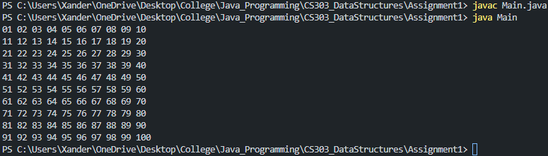
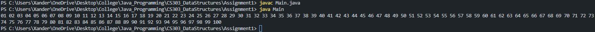
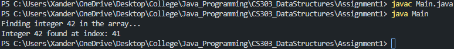
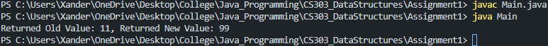
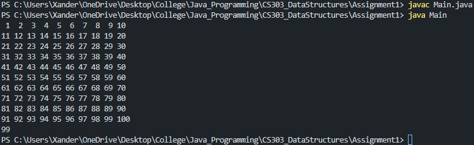
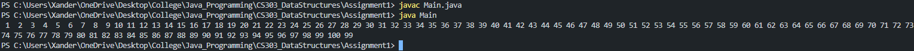
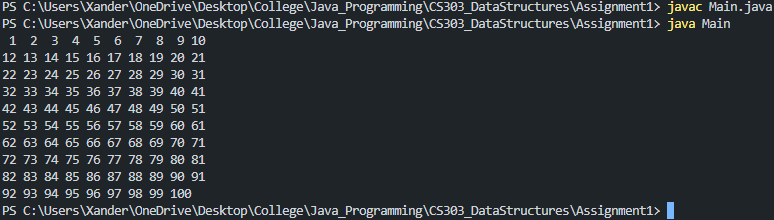
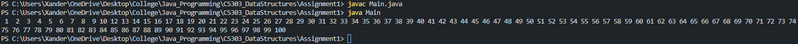
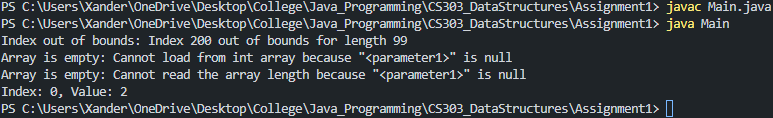
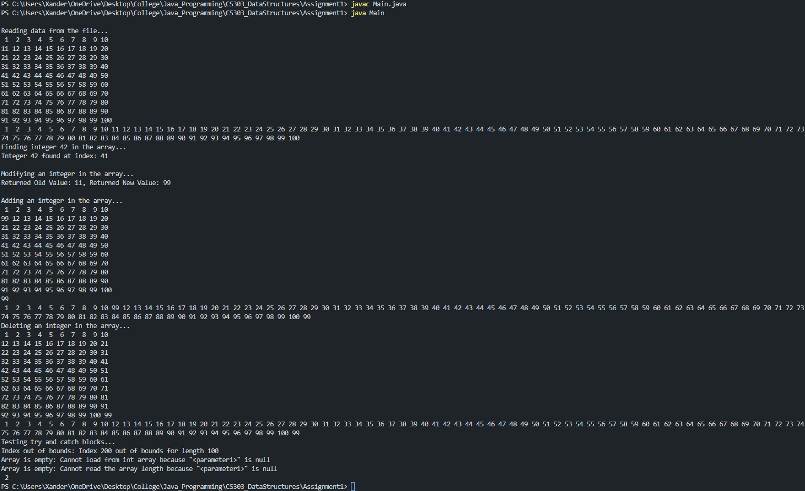

# Assignment 1 - Java Standard Array
Xander D Mosley

Professor Syed Jawad Hussain Shah, PhD Candidate

COMP-SCI 303 - Data Structures

Monday, February 16th, 2026


## Overview
To convey a deeper understanding of standard arrays within Java. The follow concepts were learned for this assignment: pulling information from a text file, array manipulation, method creation, and exception handling. The program reads integer data from an input file, stores it in a standard array, and performs several utility operations such as searching, modifying, adding, and removing values. All required functionality for the assignment was implemented in the 'Main.java' file.


## Folder Contents
📁 Assignment1/

├── 📄 `A1input.txt              # Input Data file (integers)`

├── 📘 `Assignment 1_Java.docs   # Assignment documentation (DOC)`

├── 📕 `Assignment 1_Java.pdf    # Assignment documentation (PDF)`

├── ⚙️ `Main.class               # Compiled Java bytecode (auto-created)`

├── ☕ `Main.java                # Main source code`

├── 📝 `README.md                # Assignment overview (this file)`

└── ⚙️ `ValueChange.class        # Helper class bytecode (auto-created)`


## How to Complie and Run
### Requirements
- Java Development Kit (JDK) installed (Java 17 or newer recommended)
- Command Prompt, PowerShell, or VS Code terminal

### Compile
From the 'Assignment1' directory, run the following command:
```bash
javac Main.java
```

### Run
From the 'Assignment1' direcory, run the following command after compiling:
```bash
java Main
```

### Notes
`Main.class` and `ValueChange.class` are generated automatically by the Java compiler and do not need to be edited.

Arrays in Java are fixed-size; adding or removing elements is handled by creating and returning new arrays.

Exception handling is implemented inside methods to prevent runtime crashes due to invalid input.

Ensure `A1input.txt` is located in the same directory as `Main.java` when running the program.


## Program Features
The program supports the following operations:
- Reading integers from an input file
- Searching for a specific integer in an array
- Modifying an integer at a specified index
- Adding a new integer to the end of the array
- Removing an integer at a specified index
- Handling invalid indices and null arrays using `try` / `catch` blocks

### Reading from Input File (Q1)
<p align="center">
  
</p>
<p align="center">
  
</p>

### Finding an Integer (Q1a)
<p align="center">
  
</p>

### Modifying an Integer (Q1b)
<p align="center">
  
</p>

### Adding an Integer (Q1c)
<p align="center">
  
</p>
<p align="center">
  
</p>

### Removing an Integer (Q1d)
<p align="center">
  
</p>
<p align="center">
  
</p>

### Try/Catch Blocks (Q2)
<p align="center">
  
</p>

### All of Them Together
<p align="center">
  
</p>
